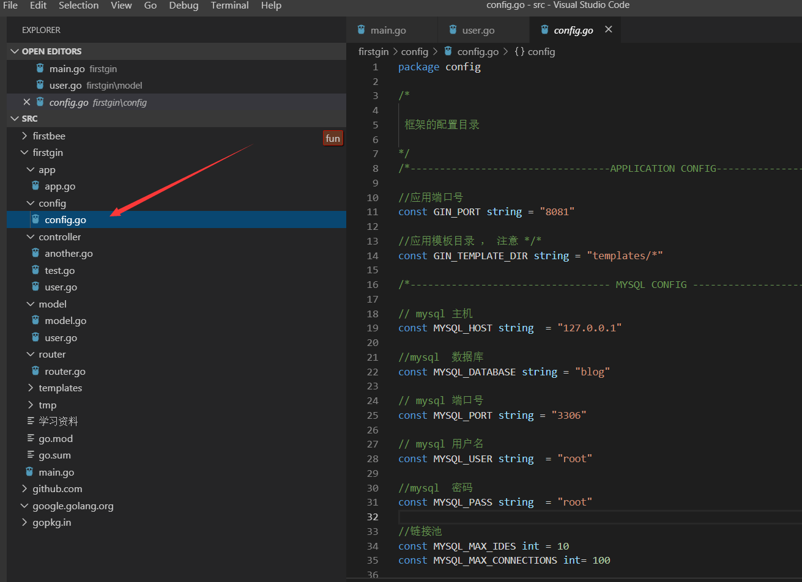

# LhdGinMvc

## indtroduction

   1 this is  mvc frame work based on  golang  gin

   2  the model  based on  mysql gorm 

  3  this frame work support api and web  develop

## contact

phone :  13194070367

mail: 1031980490@qq.com

## detail

###  directory function 

###  the entry

###  the config

###  the router

### the controller 

### the model

### the template 

# futher

​    1  i will  implement  Annotation like the spring boot

​    2 i  will make the frame more wonderful 

   3  implement the websocket  ,es ,kafka ,redis ,rabitmq  ... function  